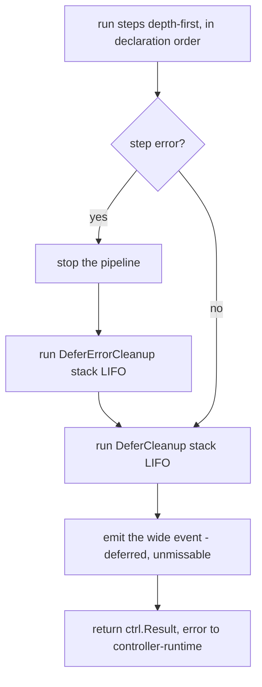

The memcached pipeline in [Your First Reconciler](/getting-started/quick) shows the common shape: a couple of owned dependencies and a status sync. This walkthrough goes the other way and puts every piece of the vocabulary into one reconcile you can read top to bottom. A `Wormhole` has no business existing in a real cluster, which is exactly why it's useful here: nothing distracts from the mechanics. It has a skip gate, nested groups with added context, two levels of gated `When`, deferred cleanup on both the error and the always paths, and a deletion mode.

The full source is in the [wormhole-operator sample](https://github.com/spechtlabs/prose/blob/main/samples/prose/wormhole-operator/internal/controller/wormhole_controller.go). We'll read it section by section.

## The whole pipeline at a glance

```go
func SetupWormholeWithManager(mgr ctrl.Manager) error {
    _, err := prose.For[*universev1alpha1.Wormhole](mgr).
        WithPredicates(prose.IgnoreStatusOnlyUpdates()).
        Owns(&corev1.ConfigMap{}).
        Owns(&universev1alpha1.Anchor{}, builder.WithPredicates(prose.IgnoreStatusOnlyUpdates())).
        Watches(&universev1alpha1.SubspaceRelay{},
            handler.EnqueueRequestsFromMapFunc(mapRelayToWormholes(mgr.GetClient())),
            builder.WithPredicates(predicate.ResourceVersionChangedPredicate{})).
        WithObservability(
            prose.Otel(otel.Tracer("wormhole")),
            prose.WideEvents(mgr.GetLogger().WithName("wormhole")),
            prose.Recorder(mgr.GetEventRecorderFor("wormhole")),
        ).
        When("paused", isPaused).Skip().
        Describe("anchors", func(g *prose.Group[*universev1alpha1.Wormhole]) {
            g.Step("reserve-coordinates", reserveCoordinates)
            g.Step("entry-anchor", upsertEntryAnchor)
            g.Step("exit-anchor", upsertExitAnchor)
        }).
        Context("now that both ends exist", func(g *prose.Group[*universev1alpha1.Wormhole]) {
            g.Step("subspace-link", openSubspaceLink)
            g.Step("ignite", chargeUp)

            g.When("charged past the ignition threshold",
                prose.Match[*universev1alpha1.Wormhole](gomega.HaveField("Status.Charge", gomega.BeNumerically(">=", ignitionThreshold))),
                func(g *prose.Group[*universev1alpha1.Wormhole]) {
                    g.Step("open-tunnel", openTunnel)

                    g.When("downstream traffic is requested",
                        prose.Match[*universev1alpha1.Wormhole](gomega.HaveField("Spec.Throughput", gomega.BeNumerically(">", 0))),
                        func(g *prose.Group[*universev1alpha1.Wormhole]) {
                            g.Step("route-traffic", routeTraffic)
                        })
                })
        }).
        Step("status", syncStatus).
        Finalize("collapse", func(g *prose.Group[*universev1alpha1.Wormhole]) {
            g.Step("drain-traffic", drainTraffic)
            g.Step("release-coordinates", releaseCoordinates)
        }).
        Complete()

    return err
}
```

Read it straight down and you have the story: skip while paused, anchor both ends (handing the coordinate back if anchoring fails), then once both ends exist open the tunnel when it's charged and route traffic when there's any to route. On delete, drain and release; the finalizer drops once that group succeeds. One reconcile, one wide event, every branch on the page.

## Setup and watches: the escape hatch in plain sight

The four lines before `WithObservability` are where `prose` proves it doesn't abandon you for the hard 20% of triggering.

```go
WithPredicates(prose.IgnoreStatusOnlyUpdates()).
Owns(&corev1.ConfigMap{}).
Owns(&universev1alpha1.Anchor{}, builder.WithPredicates(prose.IgnoreStatusOnlyUpdates())).
Watches(&universev1alpha1.SubspaceRelay{},
    handler.EnqueueRequestsFromMapFunc(mapRelayToWormholes(mgr.GetClient())),
    builder.WithPredicates(predicate.ResourceVersionChangedPredicate{})).
```

`WithPredicates(prose.IgnoreStatusOnlyUpdates())` on the primary watch keeps the wormhole's own status writes (the charge ticks you'll see below) from re-triggering the reconcile. It's deletion-safe in a way a bare `GenerationChangedPredicate` isn't: it still passes through the update that sets the deletion timestamp, so `Finalize` keeps working.

The two `Owns` calls differ on purpose. The tunnel `ConfigMap` gets no status filter, because a ConfigMap has no generation and a data edit would look status-only; you *want* drift on it to re-reconcile. The `Anchor` is a custom kind with a real status subresource, so its stability-status churn gets dropped with the same predicate.

The `Watches` line is the part a DSL usually can't express. `handler.EnqueueRequestsFromMapFunc` with a custom `MapFunc` (`mapRelayToWormholes` fans a relay change out to every wormhole routing through it, crossing namespaces because `SubspaceRelay` is cluster-scoped) and a `builder.WithPredicates` of your choosing are passed through untouched. The design test for `prose` is whether you can write exactly this without leaving the DSL, and you can.

## The skip gate

```go
When("paused", isPaused).Skip()
```

```go
func isPaused(w *universev1alpha1.Wormhole) bool {
    return w.Spec.Paused
}
```

`When(label, pred).Skip()` is sugar for the most common gate every operator repeats: pause, finalizing, and deletion-timestamp checks. The predicate is a pure boolean question over the object, no side effects, no requeue. When it holds, the pipeline skips its work and the wide event still emits, so a paused wormhole produces a clean `result` you can query rather than silence.

## Nested groups, and why `Context` reads differently from `Describe`

```go
Describe("anchors", func(g *prose.Group[*universev1alpha1.Wormhole]) {
    g.Step("reserve-coordinates", reserveCoordinates)
    g.Step("entry-anchor", upsertEntryAnchor)
    g.Step("exit-anchor", upsertExitAnchor)
}).
Context("now that both ends exist", func(g *prose.Group[*universev1alpha1.Wormhole]) {
    g.Step("subspace-link", openSubspaceLink)
    g.Step("ignite", chargeUp)
    // ... nested When blocks ...
})
```

`Describe` and `Context` are the same function; `Context` is an alias, there only so a group reads as natural language. `anchors` is a noun, the cluster of things being built, so `Describe` fits. `"now that both ends exist"` is a narrative frame for the work that depends on the anchors existing, so `Context` reads right. Pick whichever makes the sentence true.

Groups earn their keep two ways, both concrete. They structure spans: a group is a parent span and its steps are child spans, so nesting depth in your code equals span nesting depth in your traces. And they scope gating, which is the next section. Grouping is lexical and explicit. There's no hidden tree-building phase and no reordering; groups run depth-first, in declaration order, every time.

## Gated `When` groups

Inside the `Context` group, two `When` blocks nest:

```go
g.When("charged past the ignition threshold",
    prose.Match[*universev1alpha1.Wormhole](gomega.HaveField("Status.Charge", gomega.BeNumerically(">=", ignitionThreshold))),
    func(g *prose.Group[*universev1alpha1.Wormhole]) {
        g.Step("open-tunnel", openTunnel)

        g.When("downstream traffic is requested",
            prose.Match[*universev1alpha1.Wormhole](gomega.HaveField("Spec.Throughput", gomega.BeNumerically(">", 0))),
            func(g *prose.Group[*universev1alpha1.Wormhole]) {
                g.Step("route-traffic", routeTraffic)
            })
    })
```

A `When` group is a group plus a predicate that gates it. The whole cluster of steps runs only if the predicate holds, so you gate once instead of repeating the check inside every step. The outer gate asks whether `Status.Charge` has reached the ignition threshold; the inner gate, nested inside the first, asks whether `Spec.Throughput` is positive. Routing traffic therefore requires *both*: the tunnel must be open and there must be traffic to route. That AND is just the nesting, read literally.

The predicate uses `prose.Match`, which adapts a [Gomega](https://github.com/onsi/gomega) matcher into a non-panicking gate. A gate is the one place in `prose` where a matcher algebra fits cleanly, because it's a boolean with no control flow. You get the readable `HaveField`/`BeNumerically` vocabulary, and `Match` fails closed: a matcher that errors, say `HaveField` against a missing field, is treated as "does not hold" rather than crashing the reconcile. Inside step bodies you write plain Go and never matchers, because that's where branching, requeue, and error handling live.

One step inside the gates shows why `prose` keeps requeue first-class:

```go
func chargeUp(rctx *prose.Context[*universev1alpha1.Wormhole]) (prose.Outcome, error) {
    w := rctx.Object()

    target := int32(time.Since(w.CreationTimestamp.Time)/chargeInterval) * chargeStep
    if target > 100 {
        target = 100
    }

    if target > w.Status.Charge {
        w.Status.Charge = target
        if w.Status.Charge < ignitionThreshold {
            w.Status.Phase = "Charging"
        }
        if err := rctx.Client().Status().Update(rctx.Context(), w); err != nil {
            return prose.Requeue, humane.Wrap(err, "persist wormhole charge",
                "verify the Wormhole CRD has its status subresource enabled")
        }
    }
    rctx.Set("charge.level", w.Status.Charge)

    if w.Status.Charge >= ignitionThreshold {
        return prose.Continue, nil
    }
    return prose.RequeueAfter(chargeInterval), nil
}
```

While the charge sits below the threshold, the step returns `prose.RequeueAfter(chargeInterval)`. That's a normal, expected result, "no error, come back in 15s," and it's never represented as an error. The charge climbs on a wall-clock timer rather than reconcile frequency, and it only writes status when the value actually changes, so the no-op reconciles write nothing and trigger nothing. Meanwhile the `charged` gate above stays shut until `Status.Charge` reaches the threshold, at which point `chargeUp` returns `Continue` and the tunnel steps come into play.

## The two cleanup primitives

Two steps carry deferred cleanup, and the gap between them is the entire reason the names differ. Both are the inverse of Ginkgo's `DeferCleanup`, which always runs because a test always tears down. A reconciler converges, so on a successful reconcile the resources you acquired are usually the *desired state* and must not be torn down.

The first reserves a coordinate in an external registry:

```go
func reserveCoordinates(rctx *prose.Context[*universev1alpha1.Wormhole]) (prose.Outcome, error) {
    w := rctx.Object()

    if w.Status.Coordinates != "" {
        rctx.Set("coordinates.id", w.Status.Coordinates)
        return prose.Continue, nil
    }

    coord, err := subspace.Reserve(w.Spec.Destination)
    if err != nil {
        return prose.Requeue, humane.Wrap(err, "reserve subspace coordinates",
            "the subspace registry may be saturated; back off and retry")
    }

    w.Status.Coordinates = coord.ID
    rctx.Set("coordinates.id", coord.ID)
    rctx.DeferErrorCleanup(func() error { return subspace.Release(coord) })

    if err := rctx.Client().Status().Update(rctx.Context(), w); err != nil {
        return prose.Requeue, humane.Wrap(err, "persist reserved coordinates",
            "verify the Wormhole CRD has its status subresource enabled")
    }
    return prose.Continue, nil
}
```

If a *later* anchor step fails, this reservation has to go back or the next reconcile leaks it. That's `DeferErrorCleanup`: it runs LIFO, only on the unwind path, only when a subsequent step errors. It's the recommended primitive, the compensation pattern for work a later step then fails to complete. On a successful reconcile the reservation is the desired state and the cleanup correctly never fires.

The second dials a connection scoped to exactly this reconcile:

```go
func openSubspaceLink(rctx *prose.Context[*universev1alpha1.Wormhole]) (prose.Outcome, error) {
    link, err := subspace.Dial(rctx.Context())
    if err != nil {
        return prose.Requeue, humane.Wrap(err, "dial the subspace link",
            "check that the subspace relay is reachable from this cluster")
    }
    rctx.Object().Status.LinkSession = link.SessionID()
    rctx.Set("link.session", link.SessionID())
    rctx.DeferCleanup(func() error { return link.Close() })
    return prose.Continue, nil
}
```

Closing the link has no effect any other reconcile can observe, so it's safe to close on every pass. That's `DeferCleanup`: it always runs, success or failure, LIFO.

::: warning Use DeferCleanup with care
The hazard is specific and stronger than "side effects." An always-run cleanup with any cluster-observable effect couples teardown to reconcile *frequency* rather than to desired *state*. Reconciles fire constantly (resync periods, watch events, your own status writes), so an always-run cleanup that deletes a resource or decrements a counter fires on a cadence you don't control, which is the exact bug class reconcilers are supposed to be immune to. Reserve `DeferCleanup` for releasing things whose lifetime is exactly one reconcile and whose release nothing else can observe: an in-memory buffer, a non-pooled connection, a client you opened for this pass.
:::

The type enforces the caution. A `DeferCleanup` function's error can only ever land in the wide event as `cleanup.<name>.error`; it can never convert a successful reconcile into a requeue or alter the returned error.

## Unwind ordering

When you have cleanups on both paths, the order they run in matters, because cleanup outcomes have to be captured before the wide event emits. The runner guarantees this:



Error precedence is strict. The original step error is the root cause that propagates to controller-runtime; cleanup failures are additive context in the wide event, folded in as `cleanup.<name>.*`, and they never replace the original error. An always-run cleanup failing on the happy path never triggers a requeue of already-converged logic.

## The deletion mode

```go
Finalize("collapse", func(g *prose.Group[*universev1alpha1.Wormhole]) {
    g.Step("drain-traffic", drainTraffic)
    g.Step("release-coordinates", releaseCoordinates)
})
```

When `DeletionTimestamp` is set, the object is being deleted, and that's a distinct reconcile *mode*, not a deferred callback. `Finalize` gives it its own vocabulary. On the deletion path only the `Finalize` group runs, and the framework removes the finalizer once that group succeeds.

```go
func drainTraffic(rctx *prose.Context[*universev1alpha1.Wormhole]) (prose.Outcome, error) {
    rctx.Event(corev1.EventTypeNormal, "Draining", "draining traffic before collapse")
    return prose.Continue, nil
}

func releaseCoordinates(rctx *prose.Context[*universev1alpha1.Wormhole]) (prose.Outcome, error) {
    w := rctx.Object()
    if w.Status.Coordinates == "" {
        return prose.Continue, nil
    }
    if err := subspace.Release(subspace.Coordinate{ID: w.Status.Coordinates}); err != nil {
        return prose.Requeue, humane.Wrap(err, "release subspace coordinates",
            "the subspace registry rejected the release; retry")
    }
    rctx.Set("coordinates.released", w.Status.Coordinates)
    return prose.Continue, nil
}
```

`drainTraffic` only emits an event, because a status write here would never persist (the object is going away). `releaseCoordinates` hands the reserved coordinate back to the registry; if that fails it requeues, and the finalizer stays until the release succeeds, so the wormhole isn't removed while it still holds a coordinate. This is why deletion is a mode and not a `DeferCleanup`: teardown logic on delete is real reconcile work that you want sequenced, observable, and retriable like any other step.

## Reading the whole thing

Put it back together and the chain is a single readable sentence per thing the wormhole does. Skip while paused. Anchor both ends, handing the coordinate back if anchoring fails. Once both ends exist, open the tunnel when it's charged and route traffic when there's any to route. On delete, drain and release, and the finalizer drops when that's done. Every branch is on the page, every step has a span and a duration and a per-step metric, and the whole reconcile, whichever path it takes, collapses into one wide event.

From here, the [How-to Guides](/guides/observability) go deeper on wiring each sink, [Understanding](/understanding/mental-model) explains why the model is shaped this way, and the [Reference](/reference/api) and [godoc](https://pkg.go.dev/github.com/spechtlabs/prose/pkg/prose) carry the exact signatures.
