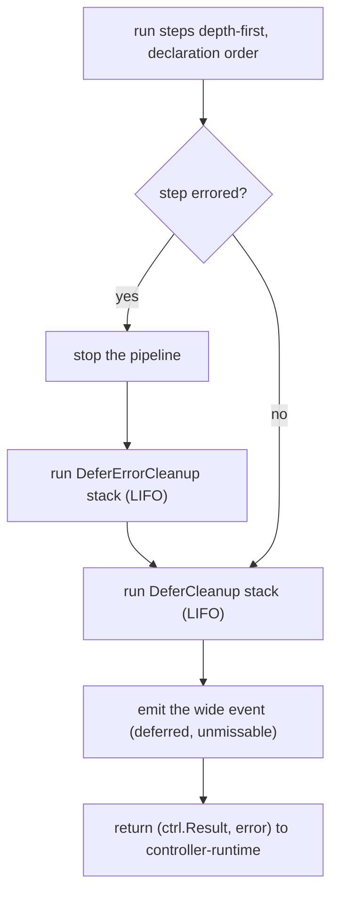

You acquired something partway through a reconcile, and a later step might fail before the work is finished. A lease you took, a slot you reserved, a connection you opened. If a later step errors, the acquisition has to be undone or the next reconcile leaks it. `prose` gives you two deferred-cleanup primitives for this, and their names carry a warning, because their triggers are opposite and both are the *inverse* of what you know from Ginkgo.

## The Ginkgo inversion

In Ginkgo, `DeferCleanup` always runs, because a test always tears down: you set up a fixture, you assert against it, you destroy it. Every time.

A reconciler doesn't work like that. A reconciler *converges*. On a successful reconcile, the resources you acquired are usually the desired state, so they must **not** be torn down; tearing them down would undo the work you just did. The whole job of a reconcile is to leave the world in the state the spec describes and then stop touching it.

That difference is why `prose` has two primitives with deliberately pointed names, and why the recommended one is the failure-only one.

## `DeferErrorCleanup`: the one you usually want

`DeferErrorCleanup` is compensation. It runs LIFO, only on the unwind path, only when a *later* step errors. If the reconcile succeeds, it never fires. It's for work that a subsequent step then fails to complete, where the half-done acquisition has to be rolled back:

```go
func reserveCoordinates(rctx *prose.Context[*v1alpha1.Wormhole]) (prose.Outcome, error) {
    coord, err := subspace.Reserve(rctx.Object().Spec.Destination)
    if err != nil {
        return prose.Requeue, humane.Wrap(err, "reserve subspace coordinates",
            "the subspace registry may be saturated; back off and retry")
    }
    rctx.Set("coordinates.id", coord.ID)
    rctx.DeferErrorCleanup(func() error { return subspace.Release(coord) }) // runs only if a later step fails
    return prose.Continue, nil
}
```

Read the registration line as a promise: "I've claimed this coordinate; if anything after me fails, hand it back." When the anchor steps that follow succeed, the claim is the desired state and the cleanup stays parked. When one of them errors, the runner unwinds and calls `subspace.Release`, so the next reconcile starts clean instead of inheriting a dangling reservation. This is the primitive to reach for by default, because it matches what a reconciler actually needs: undo a partial change only when the whole pass didn't land.

## `DeferCleanup`: always runs, and that's the hazard

`DeferCleanup` runs after every reconcile, success or failure, LIFO. The danger is specific, and it's stronger than "be careful with side effects."

::: danger Always-run cleanup couples teardown to reconcile frequency
An always-run cleanup with any cluster-observable effect ties teardown to how *often* you reconcile rather than to the desired *state*. Reconciles fire constantly: resync periods, watch events, your own status writes triggering another pass. An always-run cleanup that deletes a resource or decrements a counter is therefore firing on a cadence you don't control. That's the exact bug class reconcilers are supposed to be immune to.
:::

So `DeferCleanup` is for one narrow case: a resource whose lifetime is exactly one reconcile invocation and whose release has no observable effect on cluster state or external systems. A connection you dialed for this pass is the canonical example:

```go
func openSubspaceLink(rctx *prose.Context[*v1alpha1.Wormhole]) (prose.Outcome, error) {
    link, err := subspace.Dial(rctx.Context())
    if err != nil {
        return prose.Requeue, humane.Wrap(err, "dial the subspace link",
            "check that the subspace relay is reachable from this cluster")
    }
    rctx.Set("link.session", link.SessionID())
    rctx.DeferCleanup(func() error { return link.Close() }) // safe: closing affects no other reconcile
    return prose.Continue, nil
}
```

Closing that link has no effect any other reconcile can observe, so closing it on every pass is correct. Use `DeferCleanup` for an in-memory buffer, a non-pooled connection, a client you opened just for this reconcile. If the cleanup mutates anything another reconcile could observe, it doesn't belong in a deferred callback; it belongs in a step gated on desired state. The contrast between `reserveCoordinates` and `openSubspaceLink` is the whole reason the two names differ: one hands a registry slot back only on failure, the other closes a per-reconcile connection every time.

## Unwind ordering

The runner guarantees a fixed order, so cleanup outcomes are always captured before the wide event is emitted:



On the error path, the pipeline stops, the `DeferErrorCleanup` stack runs LIFO, then the always-run `DeferCleanup` stack runs LIFO. On the happy path, only the `DeferCleanup` stack runs. Either way, each cleanup folds `cleanup.<name>.*` fields into the event before emission, so whatever the cleanups did is in the same record as the rest of the reconcile.

LIFO matters because acquisitions nest. If `reserveCoordinates` runs before `openSubspaceLink` and a later step fails, the link closes first and the coordinate is released second, unwinding in the reverse of the order you took them. That's the same discipline as a `defer` stack, applied across steps.

## Error precedence is strict

A cleanup that fails is additive context, never a result. The rule has no exceptions:

The original step error is the root cause that propagates to controller-runtime. A cleanup failure never replaces it; it lands in the wide event as `cleanup.<name>.error` and nothing more. The error your reconcile returns is always the thing that actually broke, not whatever the compensation hit on the way down.

And the type enforces the caution around `DeferCleanup` specifically: a `DeferCleanup` function's error can only ever land in the wide event. It can't convert a successful reconcile into a requeue, and it can't alter the returned error. An always-run cleanup failure on the happy path never triggers a requeue of already-converged logic, because there's no path for it to do so. So even if you misjudge and put something fragile in a `DeferCleanup`, the worst case is a noisy field in the wide event, not a reconcile that flaps because teardown failed.

::: warning Pick the primitive by trigger, not by convenience
If you find yourself reaching for `DeferCleanup` because "it'll definitely run," stop and ask whether the cleanup is observable outside this reconcile. If it is, you want `DeferErrorCleanup` (compensation on failure) or a real step (convergence on desired state), not an always-run callback.
:::

## Verify it

Force a later step to fail and confirm the compensation fired and the *original* error is what propagated:

::: terminal

```text
# a reconcile where reserve succeeded but a later anchor step failed
$ kubectl -n wormhole-system logs deploy/controller-manager | grep 'name=sample' | tail -1
controller=wormhole name=sample result=requeue \
  anchors.reserve-coordinates.outcome=continue coordinates.id=c-4471 \
  anchors.entry-anchor.error="apply entry anchor" anchors.entry-anchor.cause="..." \
  cleanup.release.outcome=ok
# entry-anchor is the propagated root cause; cleanup.release ran on the unwind and freed coordinates.id
```

:::

The presence of `cleanup.release.outcome` next to the `entry-anchor.error` tells the whole story in one row: the later step broke, the compensation ran, and the error that reached controller-runtime is the anchor failure, not anything the cleanup did.

## Where to go next

[Add teardown with Finalize](/guides/finalizers) is the other side of cleanup: teardown on *deletion*, across reconciles, rather than compensation within one. [Wire up observability](/guides/observability) explains the `cleanup.<name>.*` fields you're reading above.
