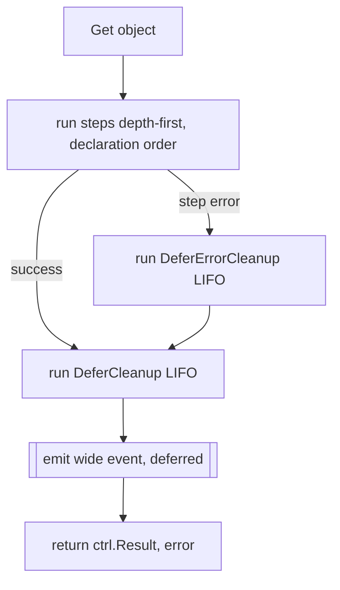

This is the part `prose` exists to get right. Everything else, the linear steps, the outcomes, the Ginkgo-flavored grouping, is in service of one property: a reconcile is one observable transaction, so it produces one record describing everything that happened, emitted at the boundary rather than dribbled through the body.

The shorthand from [the principles](/understanding/design-principles) is "observability is a boundary, not a sprinkle." This page is what that actually means once it hits the wire.

## Wide events, not log lines

A reconcile produces **one** [wide event](https://loggingsucks.com/): one structured record, not one log line per step.

The mechanism is field accumulation. Steps contribute fields to an accumulating context with `rctx.Set(key, value)`, and they don't emit anything themselves. When the reconcile returns, success or failure, the framework emits exactly one structured log line containing every field, flattened with dotted keys that mirror your group nesting.

::: terminal

```text
controller=foo namespace=team-a name=widget generation=7 result=requeue requeue_after=30s duration=412ms
  dependencies.configmap.duration=8ms  dependencies.configmap.outcome=continue
  dependencies.deployment.duration=190ms dependencies.deployment.outcome=continue dependencies.deployment.image=ghcr.io/...:v2
  status.duration=14ms status.outcome=requeue
```

:::

One reconcile, one queryable row. Look at the keys: `dependencies.deployment.image` isn't a name you typed with dots in it; the `dependencies` group wraps the `deployment` step, the step set `image`, and the framework flattened the nesting into the key. The dotted path *is* the structure of your code, which means a field's key tells you exactly where in the pipeline it came from without you ever maintaining that mapping by hand.

The alternative is the thing this model deletes: fifteen scattered log lines you have to grep, correlate by request ID, and reassemble in your head to answer "what did this one reconcile do?" A reconcile is one logical transaction, so it gets one record, and the record is wide instead of the timeline being long.

## The dotted-key flattening

The flattening rule is worth dwelling on because it's what makes the wide event queryable instead of just big.

Every step runs inside zero or more groups. The runner tracks that nesting as a prefix, so when a step calls `rctx.Set("image", ...)` while running inside `Describe("dependencies")` inside the step `deployment`, the key that lands in the event is `dependencies.deployment.image`. Steps with no enclosing group get a short prefix; steps three groups deep get a long one. The depth of the key equals the depth of the code.

Two payoffs come from that. Reading an incident, you can see at a glance which phase a field belongs to, because the prefix names the phase. Querying your logs, you can filter on `dependencies.deployment.outcome=requeue` across every reconcile in a week and find exactly the deployments that flapped, because the key is stable and structured rather than buried in a free-text message. The structure you wrote for readability is the same structure you query on later, for free.

## The defer-emit guarantee

Emission is structurally unmissable. It runs in a `defer` inside the runner, which means it fires whether the pipeline finished cleanly, returned a requeue, hit an error, or unwound through cleanup. No early return skips it. No error path forgets it. There's no code path through a `prose` reconcile that produces zero wide events, because the emit doesn't live on any path; it lives on the boundary the paths all return through.



The emit sits after every other thing the runner does, including cleanup, so cleanup outcomes are folded into the event before it goes out. Error precedence is strict: the original step error is the root cause that propagates to controller-runtime, and cleanup failures are *additive context* in the wide event (`cleanup.<name>.error`) that never replace it. You always get the event, and the event always has the real root cause.

This is also why there's no "after reconcile" hook in `prose`. The after-reconcile slot is owned by the emit boundary precisely so it can't be skipped; a user-defined hook would be a place to forget the emit, and the entire design is built so you can't.

## One field, three destinations

The same field accumulation that builds the wide log event also feeds the trace. When you call `rctx.Set`, the field lands in two places at once:

- the **wide log event**, as one `logr` line at the end of the reconcile, and
- the **OpenTelemetry span**, as an attribute.

You write the field once and it shows up in both your logs and your traces. OpenTelemetry isn't a parallel system you maintain alongside logging; it's fed by the same `Set` call. Each step is automatically a child span, each group is a parent span, and durations and errors are recorded around the steps without a single tracing call in your code. The span tree mirrors the group nesting exactly the same way the dotted keys do, because they come from the same source.

That's two of the three destinations. The third is deliberately different.

## Metrics have a separate, narrow door

Logs and spans tolerate high-cardinality fields. A field like `deployment.image=ghcr.io/team/app:v2.3.1-rc4` is perfectly fine in a wide event and perfectly fine as a span attribute; you'll query on it occasionally and it costs you nothing the rest of the time. Prometheus is the opposite. Every distinct label value is a new time series, and a high-cardinality label, an image tag, a resource name, a generation number, will multiply your series count until the scrape falls over.

So metric labels do **not** come from `rctx.Set`. They come from a deliberately bounded path, keyed only by `(controller, step, outcome)`. A per-step histogram lets you see a slow or flapping step, which controller-runtime can't show you because it only meters at the reconcile level, and it does so without ever risking a cardinality explosion from an arbitrary field key. Three labels, all bounded: the controller name (fixed), the step name (fixed by your code), and the outcome (one of a handful of enum values).

The two doors are kept separate in the type system on purpose. `rctx.Set` can't reach the metrics path even if you wanted it to, which means the cardinality safety isn't a convention you have to remember; it's a property you can't violate. That's the deliberate constraint, and it's the right one: the one knob that would let a careless field key take down your monitoring is simply not connected to the field-setting API.

::: warning Don't try to route a `Set` field into a metric
If you find yourself wishing `rctx.Set("image", ...)` also became a metric label, the field you want is high-cardinality, which is exactly the field Prometheus must not see. The wide event already has it, and that's where it belongs.
:::

## Kubernetes events stay per-emit

A Kubernetes `Event` is for the human running `kubectl describe`, not for your observability backend. It can't be folded into the wide event, and the reason is fundamental rather than a missing feature: a Kubernetes event is a discrete, timestamped, human-facing record of a state transition that lands on the object and shows up in `kubectl describe`. There's no "one mega-event per reconcile" shape it can take, because each event marks a distinct moment a human would want narrated, and collapsing fifteen of them into one row would destroy the thing that makes them useful.

So event emission stays per-emit and **opt-in per step**, for meaningful state transitions only:

```go
rctx.Event(corev1.EventTypeNormal, "Scaled", "scaled deployment to %d replicas", n)
```

Most steps emit no events. The ones that do are marking a transition a human would want to see, "scaled," "provisioned," "degraded," not logging their internal progress. The wide event and the OTel span are for you, the operator author, debugging at 3am; the Kubernetes event is for whoever runs `kubectl describe` on the object next week and wants the story in plain language. Different audience, different door.

## Configured once, at the boundary

All three outputs are wired once, at build time, not per step:

```go
prose.For[*v1alpha1.Foo](mgr).
    WithObservability(
        prose.Otel(tracer),
        prose.WideEvents(logger),                          // one canonical line per reconcile
        prose.Recorder(mgr.GetEventRecorderFor("foo")),    // kubectl-visible events
    ).
    // ... steps ...
    Complete()
```

The logger your steps would otherwise need is *derived* from the sink, pre-populated with `controller` / `namespace` / `name`. That's how `prose` deletes the "thread the logger through every function" boilerplate: there's nothing to thread, because the sink is at the boundary and the steps don't touch it. You configure the boundary once, and every step inside it contributes to the same record without knowing the record exists.

## Errors map onto the event

Steps return [humane errors](https://github.com/sierrasoftworks/humane-errors-go), and the structure maps cleanly onto the wide event. The human-facing message becomes `step.<name>.error` and the unwrapped cause chain becomes `step.<name>.cause`, so the advice you wrote for the on-call human and the underlying technical cause stay separate in the record instead of being mashed into one string.

```go
return prose.Requeue, humane.Wrap(err, "apply deployment",
    "verify the controller's ServiceAccount can create Deployments in this namespace")
```

The step name becomes the contextual frame automatically, so the error reads `deployment: <cause>` rather than a bare context, and the runner collects errors into the event via humane's structured form rather than `err.Error()`. The record preserves the advice and the cause separately, which is the whole reason to bother: at 3am you want the advice first and the stack second, and the wide event gives you both, labeled.

## Where to go next

The cleanup primitives (`DeferErrorCleanup` and `DeferCleanup`) interact with this emit ordering in ways worth understanding before you reach for them; that's covered in the [guides](/guides/) and in [Borrowing from Ginkgo](/understanding/ginkgo), where the inverted cleanup semantics get explained. For signatures, the [API reference](/reference/api) has `WithObservability`, `Otel`, `WideEvents`, and `Recorder`.
